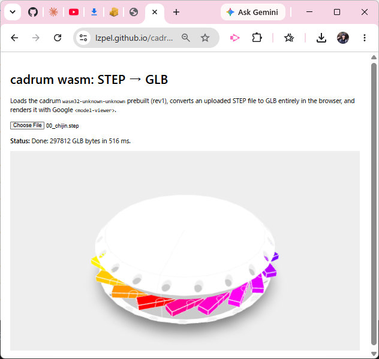

# opencascade-wasm32-unknown-unknown-example — STEP → GLB in the browser



A minimal [Trunk](https://trunkrs.dev/) app that loads a wasm build of
[cadrum](https://github.com/lzpel/cadrum) (from crates.io) and **runs entirely
in the browser**:

- **On load** it generates the `examples/00_chijin.rs` geometry dynamically
  (no STEP file is shipped) and renders it with Google `<model-viewer>`.
- **Select a `.step` / `.stp` file** and it is converted to GLB and shown.

The UI is written in Rust (`web-sys`); `<model-viewer>` is loaded from a CDN, so
there is **no JS/TS build, no npm dependency, no bundler config**.

## 🌐 Live site

**https://lzpel.github.io/opencascade-wasm32-unknown-unknown-example/**

Built and deployed by GitHub Actions (`.github/workflows/deploy.yml`): it runs
`make deploy-cross` and publishes `dist/` to GitHub Pages.

## Files

```
Cargo.toml                    # cadrum = "^0.8" (crates.io); deps; release profile
Cargo.lock                    # committed for reproducible builds
src/main.rs                   # fn main() (entry) + step_to_glb / chijin_glb + web-sys UI
index.html                    # Trunk entry; <model-viewer> CDN; data-wasm-opt="z"
Makefile                      # deploy (Trunk build) + deploy-cross (docker wrapper)
.github/workflows/deploy.yml  # make deploy-cross → Pages
```

## Build

cadrum links a C++ OCCT prebuilt and compiles a small C++ bridge for
`wasm32-unknown-unknown`, which needs the wasi-sdk clang + sysroot. cadrum
publishes a Docker image that bundles that toolchain and presets every wasm32
env var, so there is **no manual wasi-sdk setup**:

```sh
make deploy-cross   # runs `make deploy` inside ghcr.io/lzpel/cross-wasm32-unknown-unknown
                    # → static build into ./dist
```

`make deploy-cross` is the supported path (Linux/CI, or Docker Desktop locally).
`make deploy` alone is for environments that already provide the wasm32
toolchain env (i.e. *inside* the cross image); it installs Trunk and runs
`trunk build --release`.

## Notes

- **wasm-opt is enabled** (`data-wasm-opt="z"` in `index.html`): Trunk fetches
  binaryen and size-optimizes the final wasm.
- `src/main.rs` runs OCCT's C++ global constructors at startup (`__wasm_call_ctors`,
  mirroring `cadrum::wasm_start!`); without it the first OCCT call traps.
- The module uses wasm exception handling (the legacy encoding) — it runs on any
  current Chrome / Edge / Firefox, or Node (no `--experimental-wasm-exnref` flag needed).
